# ITMS — Deliverables Guide (Gantt · Use Cases · ERD · DFD)

Everything in this document is derived from the codebase at commit `42a7b09`, not
invented. Where something is reconstructed, assumed, or is my recommendation
rather than a record, **it says so** — and §5 lists every correction made to
earlier drafts of this file.

**Contents at a glance**

| § | Deliverable | Format |
|---|---|---|
| 1 | Gantt chart — 2 devs, plus doc ×2 and UAT tracks | Mermaid `gantt` |
| 2 | Use cases for citizen, officer, admin | Spec template + Mermaid / PlantUML |
| 3 | ERDs, grouped into 4 diagrams | Mermaid `erDiagram` |
| 4 | DFDs in Gane–Sarson notation | Mermaid + PlantUML |
| 5 | Tool recommendations, export steps, verification status | — |

**How to regenerate the schema facts**

```bash
python -c "
import app.models
from app.core.database import Base
for t in sorted(Base.metadata.tables.values(), key=lambda x: x.name):
    fks = sorted({list(c.foreign_keys)[0].column.table.name for c in t.columns if c.foreign_keys})
    print(f'{t.name} ({len(t.columns)}c) -> ' + (', '.join(fks) if fks else '-'))
"
```

That prints the **35** tables and their foreign keys, which is the source for §3
and §4. (An earlier draft of this file said 36; the verified count from live
metadata is 35.)

---

## Contents

1. [Gantt chart](#1-gantt-chart)
2. [Use cases for the three users](#2-use-cases-for-the-three-users)
3. [Entity–relationship diagrams](#3-entityrelationship-diagrams)
4. [Data flow diagrams (Gane–Sarson)](#4-data-flow-diagrams-gane-sarson)
5. [Tool recommendations](#5-tool-recommendations)

---

## 1. Gantt chart

### 1.1 What to draw it with

| Tool | Why | Cost |
|---|---|---|
| **Mermaid** `gantt` block | Renders in GitHub/GitLab Markdown and in VS Code with no account. Best for a school submission. | Free |
| **Google Sheets / Excel** | Easiest to hand-adjust dates; shareable as a link. | Free |
| **ProjectLibre / OpenProject** | Real scheduling engine with dependencies and critical path. | Free / self-hosted |
| **Microsoft Project** | Industry standard, but overkill for 5 people. | Paid |

**Recommendation: Mermaid for the deliverable, Sheets if the marker wants a
spreadsheet.** The Mermaid block below is paste-ready.

### 1.2 The plan

> **Provenance:** `PROJECT_SPEC.md` was deleted in commit `2878d05` during the
> `origin/main` rewrite. This is reconstructed from the version that existed at
> `0402f17`. It is the *original* 8-week plan, not a record of what actually
> happened — see §1.4 for the real history. Actual calendar dates were never
> committed anywhere in the repo, so weeks are relative.

**Team of 5: 2 developers, 2 documentation, 1 UAT**

The workload is split by *requirement number*, not by module. The requirement
list is section 7 of `RTSA_ITMS_AGENT_SPEC.md`.

| Person | Role | Owns |
|---|---|---|
| **Dev 1** | Developer | Requirements **1–10** — the roadside/regulatory core: vehicle registration, driver licensing, traffic violations, PSV, inspection, insurance, accidents, toll enforcement, ANPR, e-Challan |
| **Dev 2** | Developer | Requirements **11–20** — the platform/service layer: citizen portal, revenue & payments, notifications, administration, security, reporting & analytics, inter-agency integration, performance, availability & DR, scalability |
| **Doc 1** | Documentation | System documentation: `README.md`, `docs/PLATFORM.md`, API reference |
| **Doc 2** | Documentation | User manuals and training material for citizen, officer, admin |
| **UAT** | User Acceptance Testing | Test cases, execution, defect logging, sign-off |

Two requirements need a named owner regardless of the split, because both
devs depend on them:

- **R21 — toll-gate compliance decision logic** (spec §4). This is Dev 1's,
  since it is the rule engine behind R8, and Dev 2's toll dashboards consume
  its output. It is not a 21st requirement; it is the detailed spec for R8.
- **R22 — expected outcomes** (spec §7). Not build work. It is the UAT
  acceptance criteria: the tests that prove the system actually improved road
  safety, detection speed, collection rate, and so on.

### 1.2.1 Where this split actually shows in the repo

The 2-dev split is *not* visible in git — the history predates it. What git does
show is a **module-based** split across 5 developers, recorded in the
`PROJECT_SPEC.md` that existed at `0402f17` and was deleted in `2878d05`:

| Original dev | Owned |
|---|---|
| 1 | Vehicle registration, driver licensing, inspection, insurance |
| 2 | Violations, e-Challans, ANPR, toll compliance engine |
| 3 | PSV, accidents, inter-agency integration |
| 4 | Citizen portal, payments, notifications |
| 5 | Auth/RBAC, admin, security, reporting, CI/CD, Render + Neon infra |

Your current 2-dev split **re-groups** those five into two. Dev 1 absorbs the
old devs 1 + 2 + 3 (the roadside core, requirements 1–10); Dev 2 absorbs the
old devs 4 + 5 (the platform layer, requirements 11–20). This is worth saying
out loud in your write-up, because it is the honest reason the two developers
have uneven loads: Dev 1 owns 10 requirements of *heavy* domain logic, while
several of Dev 2's requirements (R18 performance, R19 DR, R20 scalability) are
largely satisfied by infrastructure choices rather than feature code.

### 1.3 Paste-ready Mermaid Gantt

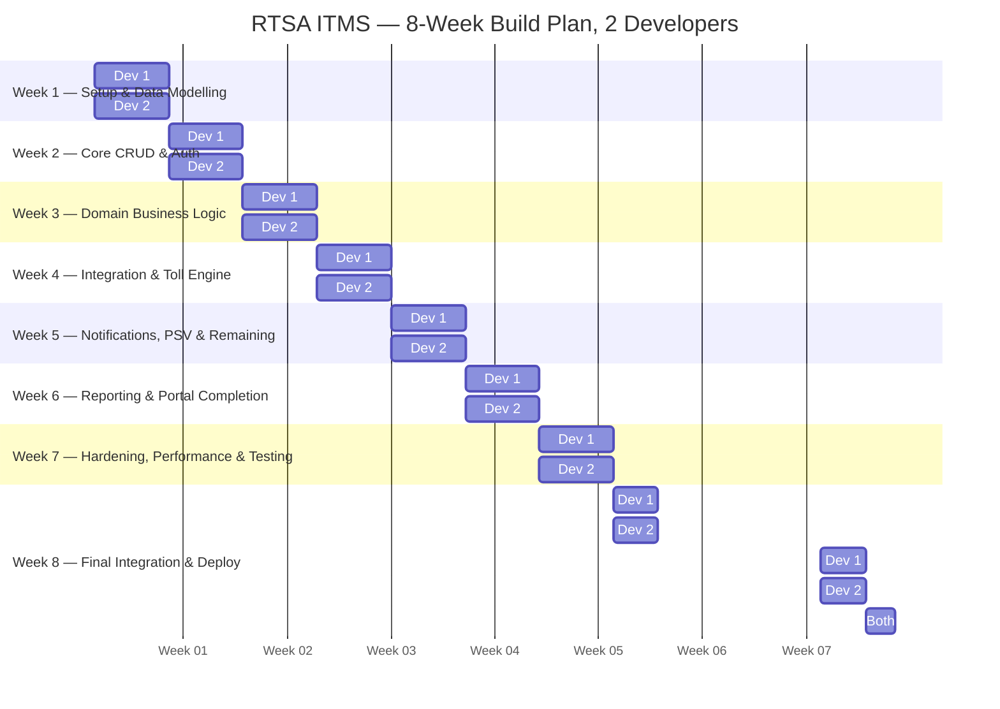

Task IDs are unique per developer (`d1_*`, `d2_*`) so `after` resolves
unambiguously. The week-8 deploy tasks are pinned to dates rather than
dependencies because the production deploy is a single shared activity.

**Change the start date `2026-01-05` to your actual week 1 Monday and everything
else shifts with it.**

### 1.3.1 Documentation and UAT tracks

The two documentation writers and the UAT tester are **not** idle until week 8.
They work in parallel, and this is the part most students get wrong on a Gantt —
a doc track that only starts during the final week is not a plan, it is an
afterthought. If your school submission wants one chart, use the combined Gantt
below; if it wants separate charts, use §1.3 for the devs and this one for the
non-dev tracks.

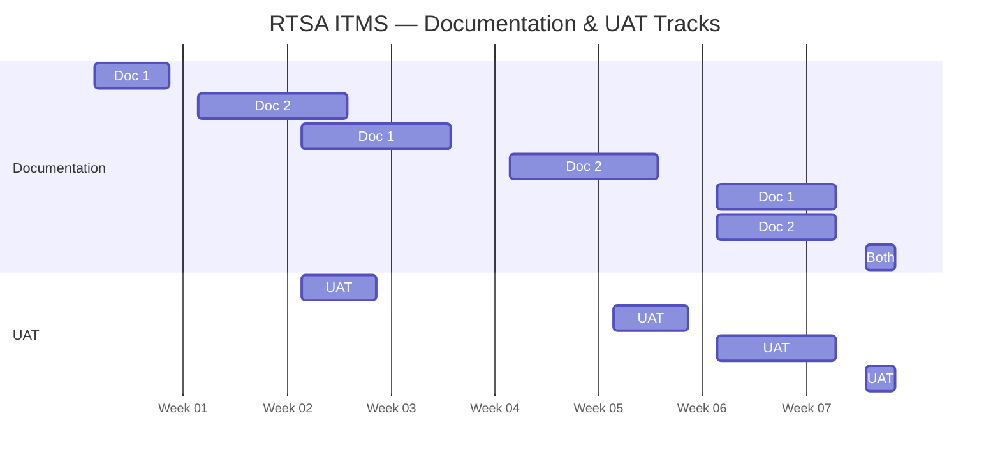

Why the timing is what it is:

| Track | Rationale |
|---|---|
| **Doc 1 — spec week 1** | Write the data dictionary from the models *while* they are being designed. Documenting a schema after it is built means documenting it wrong. |
| **Doc 1 — API reference from week 3** | The route decorators already exist by then. Docs that lag code by 2 weeks is normal; 6 weeks is not. |
| **Doc 2 — manuals from week 2** | User manuals can be drafted against mockups and the role matrix long before the screens are final. |
| **UAT — plan in week 3** | Test cases derive from the requirements (R1–R20) and the acceptance criteria (R22), both of which are stable by week 3. |
| **UAT — smoke test week 5** | Catches integration breakage while there is still time to fix it. Waiting until week 8 turns UAT into a bug report. |
| **UAT — sign-off week 8** | Sign-off must come *after* the final deploy, or it signs off on the wrong build. |

**The critical dependency:** UAT cannot start until there is something running.
That is why `uat_smoke` is pinned to week 5 rather than chained after
`d1_echallan` — the devs' week-5 tasks are still in flight, so UAT tests the
deployed staging build, not the local branch.

### 1.4 What actually happened (real history from git)

The 8-week plan above is the *intent*. `git log` tells a different story, and if
your marker asks "how did the project actually go", use this instead.

| Phase | Evidence in git |
|---|---|
| Initial scaffold, CI, per-module skeletons | `8a7f6e5` |
| Official API contract (Dev 2 spec) | `d501aaf` |
| Dev 1 transport & enforcement domain build | `0402f17` |
| Backend with road network, routing, incident alerts, driver portal | `51ba81c` |
| Deploy fixes: Render blueprint, migrations at startup, bcrypt swap | `b7e76e3`, `c1dc604`, `f760b67` |
| Role-based web frontend + design system + mobile | `9f1daa1`, `247abc1`, `f0c312d` |
| Dev 2 platform: security, payments, reports, integration, ops | `5a561b0` |
| Offline toll event synchronisation | `4ca51f9` |
| SSE realtime updates across accounts | `3f3542e` |
| Staff MFA hardening + CAPTCHA + National ID | `77fabbd`, merged `ffb28bc` |
| 9 feature branches merged in one PR (Redis, backups, benchmarks, signup, password reset, SSE filters) | `8916e29` |
| Offence taxonomy (driver / vehicle / both) | `86b05d8` |

**Scope that was never in the original plan:** road network + OSRM route
planning, Leaflet maps, SSE live updates, Redis shared state, encrypted
off-site backups, Postgres benchmarks, citizen self-signup, password reset with
email verification, and the road-alert feed. Treat these as unplanned additions,
not schedule slippage.

---

## 2. Use cases for the three users

The system has **four** roles in `app/core/security.py`, but three primary
actors. `toll_operator` is a deliberately narrow fourth: it can post toll events
and view reports, nothing else (`app/core/permissions.py:35`).

| Actor | Scope | RBAC anchor |
|---|---|---|
| **Citizen** | Own vehicles, fines, licence, applications, payments, profile & security | `DEFAULT_ROLE_PERMISSIONS["citizen"] = set()` — own data via ownership queries, not permissions |
| **Officer** | Record violations & inspections, issue licences, toll events; view + export reports | `{"reports:view", "reports:export"}` |
| **Admin** | Everything, plus users, settings, integrations, ops | `set(PERMISSIONS)` — all 14 |

### 2.1 Use case specification template

Use this structure for every use case. It is the format most markers expect.

```
ID:            UC-01
Name:          Register a vehicle
Actor:         Officer (primary), Admin (secondary)
Precondition:  Officer is authenticated; MFA enrolled (staff policy)
Trigger:       Officer submits the registration form
Main flow:     1. Officer enters registration no., owner, make, model, year
               2. System validates the registration number is unique
               3. System writes the vehicle record
               4. System writes an audit log entry
Postcondition: Vehicle is ACTIVE and searchable
Alternate:     2a. Number already exists → 409, show the existing record
               3a. Validation fails → 422 with field-level detail
```

### 2.2 Citizen use cases

| ID | Use case | Endpoint | Precondition |
|---|---|---|---|
| UC-C1 | Register an account | `POST /api/auth/register` | Anonymous |
| UC-C2 | Verify email / reset password | `POST /api/auth/*` | Token from email |
| UC-C3 | View my dashboard (vehicles, licence, fines) | `GET /api/citizen/dashboard` | Authenticated citizen |
| UC-C4 | View my vehicles | `GET /api/citizen/my-vehicles` | Authenticated |
| UC-C5 | View a vehicle's compliance status | `GET /api/citizen/vehicles/{id}` | Owns the vehicle |
| UC-C6 | View my outstanding fines | `GET /api/portal/fines` | Owns the vehicle |
| UC-C7 | **Pay a fine** | `POST /api/portal/fines/{id}/pay` | Owns the vehicle; not already paid |
| UC-C8 | View my driver licence | `GET /api/portal/licence` | Linked driver record |
| UC-C9 | Renew my licence | `POST /api/portal/licence/renew` | Licence exists |
| UC-C10 | View my licence applications | `GET /api/citizen/applications` | Authenticated |
| UC-C11 | Track an application | `GET /api/citizen/applications/{id}` | Owns the application |
| UC-C12 | View my payments / receipts | `GET /api/citizen/payments` | Authenticated |
| UC-C13 | Update my profile & security (MFA, password) | `PATCH /api/citizen/profile`, `/api/auth/*` | Authenticated |
| UC-C14 | Set notification preferences | `GET/PUT /api/notifications/preferences` | Authenticated |
| UC-C15 | View live road alerts near me | `GET /api/portal/alerts` | Authenticated |
| UC-C16 | **Report a road incident** | `POST /api/incidents/` | NRC on the account; not suspended; declares it true |
| UC-C17 | Track my reports | `GET /api/incidents/mine` | Authenticated |

> **Corrected against the route decorators.** An earlier draft listed
> `/api/citizen/applications` as `GET/POST` and `/api/notifications` for
> preferences. Neither is right: `citizen.py:266` is `GET`-only (applications are
> *created* by an officer via `/api/licence-applications`, then the citizen
> tracks them), and preferences live at `/api/notifications/preferences`
> (`notifications.py:68,85`).

**UC-C7 in detail** — the highest-value citizen flow:

```
ID:            UC-C7
Name:          Settle an e-Challan
Actor:         Citizen
Precondition:  Citizen authenticated; challan belongs to one of their vehicles;
               challan.status != PAID
Trigger:       Citizen clicks "Pay now" on the fines table
Main flow:     1. System verifies vehicle ownership (403 otherwise)
               2. System creates a Payment of type FINE
               3. System marks the challan PAID
               4. System writes the payment to the revenue ledger
               5. System issues a receipt reference
               6. System queues a receipt notification
               7. System writes an audit log entry
Postcondition: Challan is PAID; receipt visible under "Receipts"
Alternate:     1a. Not the owner → 403 "This fine is not charged to you or your vehicles"
               2a. Payment above settings.payments.max_amount → 422
Exceptions:    Gateway timeout → payment left PENDING, reconcilable later
```

### 2.3 Officer use cases

| ID | Use case | Endpoint | Notes |
|---|---|---|---|
| UC-O1 | Search vehicle records by plate | `GET /api/vehicles/by-registration/{plate}` | Fills the violation form |
| UC-O2 | Register a vehicle | `POST /api/vehicles/` | |
| UC-O3 | **Record a traffic violation** | `POST /api/enforcement/violations` | See UC-O3 detail |
| UC-O4 | View recent violations | `GET /api/enforcement/violations` | `require_role(*OFFICERS)` |
| UC-O5 | View and filter challans | `GET /api/enforcement/challans` | Filter by status |
| UC-O6 | Mark a challan paid | `POST /api/enforcement/challans/{id}/pay` | |
| UC-O7 | Record an inspection & issue fitness cert | `/api/inspections` | |
| UC-O8 | Issue a driver licence | `POST /api/licence-applications/{id}/issue` | After theory + practical |
| UC-O9 | Record an ANPR sighting | `POST /api/anpr/events` | |
| UC-O10 | Post a toll-gate event | `POST /api/toll/events` | Runs the compliance engine |
| UC-O11 | Sync offline toll events | `POST /api/toll/offline/sync` | Idempotent on `device_event_id` |
| UC-O12 | Record a road accident | `POST /api/accidents` | |
| UC-O13 | Report a road incident / alert | `POST /api/incidents` | Also drives the alert feed |
| UC-O14 | View and export reports | `GET /api/reports/{key}` | Needs `reports:export` |
| UC-O15 | Confirm a citizen road report | `POST /api/incidents/{id}/confirm` | Alerts motorists; an accident opens a case |
| UC-O16 | Dismiss a report, or reject it as false | `POST /api/incidents/{id}/dismiss` | `false_report: true` fines the reporter |

**UC-O3 in detail** — the flow that exercises the offence taxonomy:

```
ID:            UC-O3
Name:          Record a traffic violation
Actor:         Officer
Precondition:  Officer authenticated + MFA enrolled
Trigger:       Officer submits the violation form
Main flow:     1. Officer looks up the vehicle by plate (auto-fills vehicle_id)
               2. Officer picks an offence type from a dropdown grouped by
                  category: Driver / Vehicle / Both
               3. System shows a live hint: who is liable and what the
                  consequence is (licence risk vs impoundable)
               4. System derives liable_party from the offence type
                  (driver / owner / both) and stores it on the violation
               5. System writes the violation
               6. System generates an e-Challan with a unique reference
                  CH-YYYYMMDD-XXXXXX
               7. System resolves the owner and queues a notification
               8. System writes an audit log entry
Postcondition: Violation + Challan exist; owner notified
Alternate:     2a. "Both" category → hint says driver and owner may both be liable
Exceptions:    Notification provider down → logged, does not roll back the challan
```

### 2.4 Admin use cases

| ID | Use case | Endpoint | Permission |
|---|---|---|---|
| UC-A1 | View admin dashboard | `GET /api/admin/reports/summary` | — |
| UC-A2 | Manage users (create, deactivate, unlock) | `/api/admin/users`, `/api/admin/login-attempts` | `users:manage` |
| UC-A3 | **Manage the role permission matrix** | `GET /api/admin/permissions`, `PUT /api/admin/permissions/{role}/{permission}` | `roles:manage` |
| UC-A4 | Configure system settings & thresholds | `/api/admin/settings` | `settings:manage` |
| UC-A5 | View toll transactions | `GET /api/toll/transactions` | `settings:manage` |
| UC-A6 | Configure notification rules & broadcasts | `/api/admin/notification-rules`, `/api/admin/notifications/broadcast` | `notifications:manage` |
| UC-A7 | Register an external agency API client | `/api/integration/*` | `integrations:manage` |
| UC-A8 | View the revenue ledger & reconcile payments | `/api/payments`, `/api/payments/reconciliation/run` | `payments:reconcile` |
| UC-A9 | Issue refunds | `POST /api/payments/{payment_id}/refund` | `payments:refund` |
| UC-A10 | View audit log & login history | `/api/admin/audit-logs`, `/api/admin/login-attempts` | `audit:read` |
| UC-A11 | View metrics, capacity, backups, system health | `/api/system/*` | `system:monitor` |
| UC-A12 | Export reports as CSV / Excel / PDF | `GET /api/reports/{key}?format=…` | `reports:export` |

> **Corrected against the route decorators.** An earlier draft listed
> `/api/admin/dashboard`, `/api/admin/roles`, `/api/admin/audits` and
> `/api/reports/*/export`. None of those exist. The real paths are
> `/api/admin/reports/summary` (`admin.py:392`), `/api/admin/permissions`
> (`admin.py:267`), `/api/admin/audit-logs` (`admin.py:358`), and export is a
> `format` query parameter on `/api/reports/{key}` — the UI builds it as
> `download("/api/reports/" + key + "?format=csv")` (`platform.js:132`), not a
> separate route.

**UC-A3 in detail** — the RBAC matrix is data, not code, so it is worth showing:

```
ID:            UC-A3
Name:          Grant a permission to a role
Actor:         Admin
Precondition:  Admin authenticated; permission key exists in the PERMISSIONS catalogue
Trigger:       Admin toggles a permission on the roles page
Main flow:     1. System loads role_permissions rows
               2. Admin grants or revokes one permission
               3. System writes the row
               4. System invalidates the 15-second permission cache
Postcondition: Change takes effect within 15s without a redeploy
Constraint:    The `admin` role always retains every permission, so nobody can
               lock themselves out
Alternate:     2a. Unknown permission key → 422
```

### 2.5 Render-ready Mermaid for use cases

Mermaid has no native use-case diagram, but this is the accepted workaround —
one subgraph per actor, grouped by package.

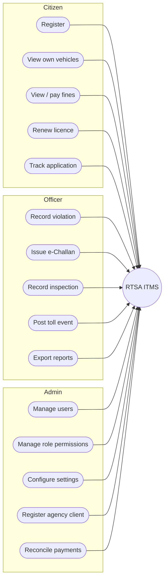

**If your marker needs a proper IEEE-style use case diagram** (ovals, diamonds,
`<<include>>` / `<<extend>>`), use **PlantUML** instead:

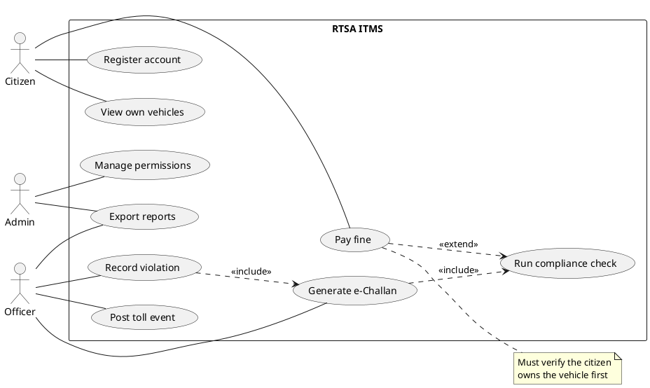

---

## 3. Entity–relationship diagrams

### 3.1 The schema, grouped

**35 tables** in 8 clusters. Cardinality is read from the actual foreign keys.
In Mermaid crow's foot, the symbol *left* of the pair describes the **child**
side (how many children a parent may have) and the symbol *right* of the pair
describes the **parent** side (how many parents a child must have). A `REQUIRED`
FK means the parent is mandatory (`||`); an `OPTIONAL` FK means it is `|o`.

**How this was checked** (run from the repo root, so the numbers are real):

```bash
python -c "
import app.models
from app.core.database import Base
for t in sorted(Base.metadata.tables.values(), key=lambda x: x.name):
    rels = []
    for c in t.columns:
        if c.foreign_keys:
            fk = list(c.foreign_keys)[0]
            rels.append(f'{c.name}->{fk.column.table.name} '
                        f'{\"OPTIONAL\" if c.nullable else \"REQUIRED\"}')
    if rels: print(t.name, rels)
"
```

| Cluster | Tables |
|---|---|
| Identity & access | `users`, `user_sessions`, `devices`, `role_permissions`, `login_attempts`, `system_settings`, `audit_logs` |
| Registration & licensing | `vehicles`, `drivers`, `licence_applications` |
| Roadworthiness & cover | `inspections`, `fitness_certificates`, `insurance`, `psv_operators`, `psv_permits` |
| Enforcement | `violations`, `challans`, `anpr_events` |
| Toll | `toll_transactions`, `toll_offline_events` |
| Money & messaging | `payments`, `payment_events`, `reconciliation_runs`, `notifications`, `notification_rules`, `notification_preferences` |
| Road network & accidents | `roads`, `intersections`, `road_segments`, `road_incidents`, `route_cache`, `accidents`, `accident_vehicles` |
| Integration | `agency_clients`, `integration_logs` |

### 3.2 Core ERD — registration, enforcement, money

This is the one to draw if you only have room for one diagram. It carries the
whole toll-compliance story.

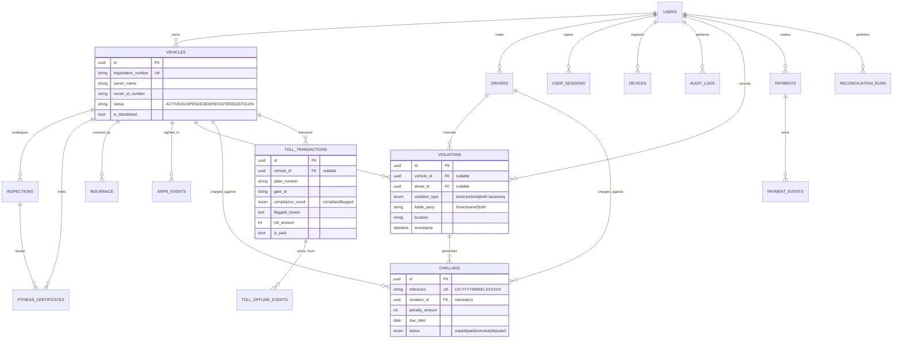

### 3.3 Road network & accidents ERD

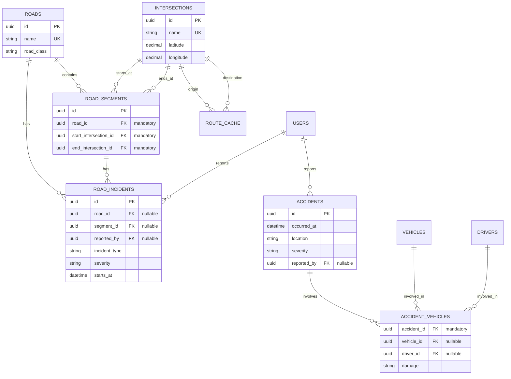

### 3.4 Platform ERD — access, money, messaging, integration

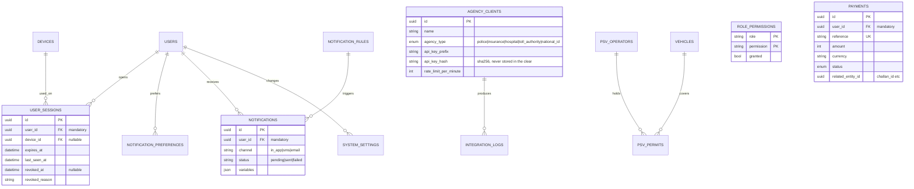

### 3.5 Notation notes for your ERD key

- **Crow's foot** is what the Mermaid output above uses (`||--o{` = one-to-zero-or-many).
- **PK** primary key, **FK** foreign key, **UK** unique constraint.
- **17 tables** carry a unique constraint: 14 via a single-column `unique=True`
  (`agency_clients`, `challans`, `drivers`, `fitness_certificates`, `insurance`,
  `intersections`, `notification_rules`, `payments`, `psv_operators`,
  `psv_permits`, `roads`, `toll_offline_events`, `users`, `vehicles`) plus 3 with
  only a composite `UniqueConstraint` (`devices`, `notification_preferences`,
  `role_permissions`). An earlier draft claimed 21; that came from counting grep
  matches, not tables.
- The load-bearing ones are `vehicles.registration_number`,
  `drivers.licence_number`, `challans.reference`, `payments.reference`, and
  `toll_offline_events.device_event_id` — that last one is what makes offline
  sync idempotent.
- `users` is the root of most clusters but is **not** a supertype — `vehicles`
  and `drivers` are linked to it by nullable `user_id`, because a vehicle can be
  registered by an officer on behalf of an owner who has no account, and an ANPR
  sighting has no driver at all. If you draw specialisation, draw it as
  0..1, not 1..1.

---

## 4. Data flow diagrams (Gane–Sarson)

### 4.1 Notation rules — get these right

Gane–Sarson (1979) differs from Yourdon in one visible way: **data stores are
open-ended rectangles**, drawn as three parallel lines rather than a closed
box. Everything else matches.

| Element | Shape | Naming |
|---|---|---|
| **External entity** | Rectangle | Noun, plural — e.g. `Citizen` |
| **Process** | **Rounded** rectangle | Decimal number + verb phrase — `1.0 Register Vehicle` |
| **Data store** | **Open rectangle** (3 lines) | `D1 Vehicles` |
| **Data flow** | Named line | Verb + noun — `submits registration data` |

Process numbering is hierarchical: `1.0` at level 0, `1.1`/`1.2` when `1.0` is
decomposed at level 1. Gane–Sarson is *balanced* — every child process maps to
exactly one parent, unlike pure Yourdon.

### 4.2 Context diagram (level −1)

The whole system as a single process, with every external entity.

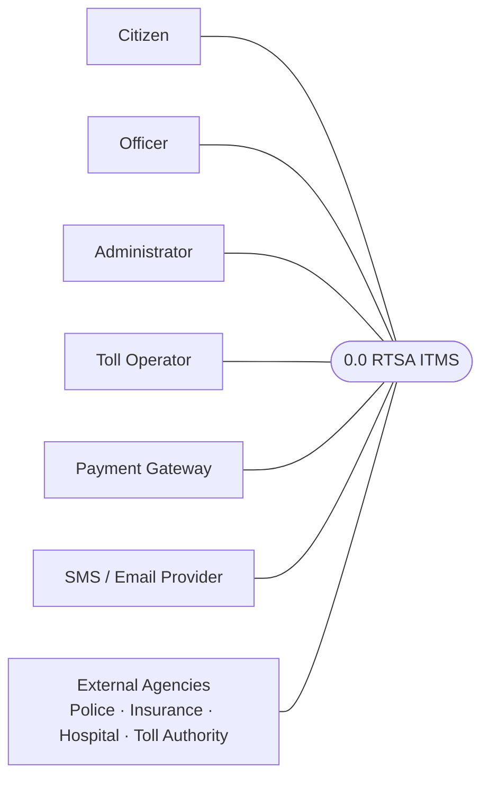

Flows, named verb-noun:

| # | From | To | Flow |
|---|---|---|---|
| 1 | Citizen | 0.0 | submits vehicle / licence / payment requests |
| 2 | 0.0 | Citizen | returns vehicle, licence, fine and receipt data |
| 3 | Officer | 0.0 | submits violation, inspection, accident data |
| 4 | 0.0 | Officer | returns search results, e-Challans, compliance decisions |
| 5 | Administrator | 0.0 | submits user, role, setting and integration changes |
| 6 | 0.0 | Administrator | returns audit log, metrics, reports, revenue ledger |
| 7 | Toll Operator | 0.0 | submits toll-gate events and offline batches |
| 8 | 0.0 | Toll Operator | returns flag decisions, transaction ids, sync results |
| 9 | 0.0 | Payment Gateway | submits payment authorisation requests |
| 10 | Payment Gateway | 0.0 | returns authorisation results and webhooks |
| 11 | 0.0 | SMS / Email Provider | submits notification payloads |
| 12 | 0.0 | External Agencies | exchanges scoped agency data over API |

### 4.3 Level 0 DFD

Process 0.0 exploded into seven processes. Data stores are the open rectangles.

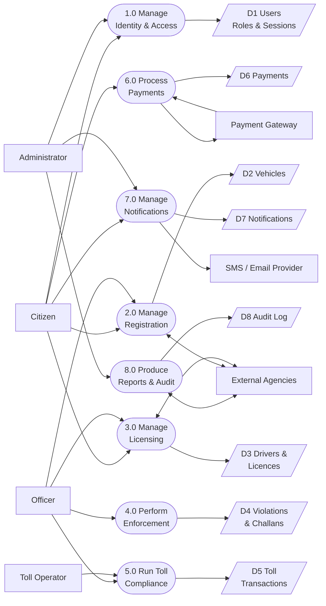

| # | From | To | Flow |
|---|---|---|---|
| 1.1 | Citizen | 1.0 | submits login credentials |
| 1.2 | 1.0 | Citizen | returns session token and profile |
| 2.1 | Officer | 2.0 | submits vehicle registration data |
| 2.2 | Citizen | 2.0 | requests own vehicle data |
| 2.3 | 2.0 | D2 | writes vehicle records |
| 2.4 | D2 | 2.0 | reads vehicle records |
| 4.1 | Officer | 4.0 | submits violation data |
| 4.2 | 4.0 | D4 | writes violations and e-Challans |
| 4.3 | 4.0 | 7.0 | sends challan-issued event |
| 5.1 | Toll Operator | 5.0 | submits plate, gate and timestamp |
| 5.2 | 5.0 | D2 | reads vehicle, insurance, fitness, permit |
| 5.3 | 5.0 | D4 | writes flag decision and e-Challan |
| 5.4 | 5.0 | D5 | writes toll transaction |
| 5.5 | 5.0 | Toll Operator | returns compliance decision |
| 5.6 | 5.0 | 7.0 | sends owner notification |
| 6.1 | Citizen | 6.0 | submits payment request |
| 6.2 | 6.0 | Payment Gateway | submits authorisation request |
| 6.3 | 6.0 | D6 | writes payment and receipt |
| 7.1 | 7.0 | SMS / Email Provider | submits notification payload |
| 7.2 | 7.0 | D7 | writes notification status |
| 8.1 | Administrator | 8.0 | requests report or audit export |
| 8.2 | 8.0 | D8 | reads audit log |
| 8.3 | 8.0 | Administrator | returns report in CSV / Excel / PDF |

### 4.4 Level 1 — decomposing the toll engine

This is the one that maps to spec Section 22, so it is worth drawing separately.
Process 5.0 exploded; 6.0 is left un-decomposed here (it has no domain logic).

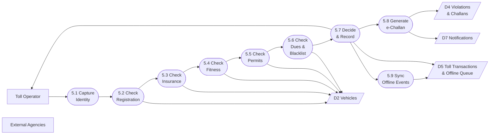

| # | From | To | Flow |
|---|---|---|---|
| 5.1 | Toll Operator | 5.1 | submits plate, gate id, lane, timestamp |
| 5.2 | 5.1 | 5.2 | submits normalised registration number |
| 5.3 | 5.2 | D2 | reads vehicle registration status |
| 5.4 | 5.3 | D2 | reads insurance validity |
| 5.5 | 5.4 | D2 | reads fitness certificate expiry |
| 5.6 | 5.5 | D2 | reads PSV permit status |
| 5.7 | 5.6 | D2 | reads outstanding dues and blacklist state |
| 5.8 | 5.7 | 5.8 | submits non-compliant issues |
| 5.9 | 5.8 | D4 | writes violation and e-Challan |
| 5.10 | 5.7 | D5 | writes toll transaction with compliance result |
| 5.11 | 5.7 | Toll Operator | returns decision — proceed or flag |
| 5.12 | 5.8 | D7 | queues owner notification |
| 5.13 | 5.9 | D5 | writes offline queue entry, later marks synced |
| 5.14 | 5.7 | External Agencies | publishes compliance event for monitoring |

**Note the compliance loop is 6 sequential reads in the current code.** The
original design intent (documented in the deleted `compliance_engine.py`) was a
single indexed query returning all six checks at once, to hit the 500 ms Section
18 SLA. The current `app/services/compliance.py` does them one at a time. If a
marker asks about performance, that is the honest answer, and the
`feature/postgres-benchmarks` branch (now merged) contains the measurements.

### 4.5 PlantUML for true Gane–Sarson shapes

Mermaid cannot draw an open-ended data store, so the diagrams above approximate it
with `[/"text"/]`. **PlantUML does not solve this either** — its `database`
keyword draws a *cylinder*, which is Yourdon/IEEE style, not Gane–Sarson.

If the notation must be exact, the honest options are:

1. **Hand-draw or use a vector editor** (draw.io, Lucidchart, Inkscape) for the
   data stores, then keep Mermaid/PlantUML for everything else.
2. **PlantUML with a rectangle plus a note** — `rectangle "D1 Vehicles"` renders a
   closed box, which is still not the three-line open store, but is closer than a
   cylinder and is defensible if you label the notation in your key.
3. **Sketch a Symbol Font / stencilled template**, which is how Gane–Sarson
   diagrams were originally produced in the 1979 paper.

If your marker accepts either notation, say so explicitly in the diagram key and
use the PlantUML below — with `database` renamed to `rectangle` so the shapes stay
consistent with the context diagram.

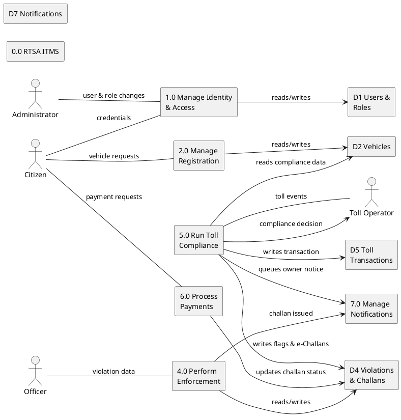

---

## 5. Tool recommendations

| Deliverable | Recommended | Alternative |
|---|---|---|
| Gantt | Mermaid `gantt` in this file | Google Sheets, ProjectLibre |
| Use cases (docs) | The spec template in §2.1, in Markdown | Word/Lucidchart |
| Use cases (diagram) | PlantUML | Lucidchart, Visual Paradigm |
| ERD | Mermaid `erDiagram` in §3 | dbdiagram.io, draw.io, MySQL Workbench |
| DFD | PlantUML in §4.5 for exact Gane–Sarson | Lucidchart, Visio |
| Everything in one place | **Structurizr / C4** — renders Mermaid and keeps ERD + DFD + use cases in one model | — |

### Export to PDF / Word

- **VS Code** — install *Markdown PDF* or *Markdown All in One*, right-click → *Markdown PDF*.
- **CLI** — `pandoc deliverables.md -o deliverables.pdf` (needs LaTeX for PDF, or use `-t html` for Word-compatible).
- **GitHub** — push and use `https://r.jina.ai` or a print-to-PDF of the rendered page, which keeps Mermaid diagrams.

### One caution

Mermaid renders on GitHub, VS Code, GitLab, Obsidian and Notion. It does **not**
render on plain GitHub wikis or inside a `.docx`. If the submission must be a
Word document, export each Mermaid block to an image
(`mermaid.ink/<base64>` or the VS Code *Markdown Preview Mermaid Support*
extension → right-click → *Save image as*) and paste the images in.

---

## Verification status

| Item | Status | How it was checked |
|---|---|---|
| Table count (35) and FK nullability (§3) | **Verified** | Live `Base.metadata` at `42a7b09` |
| Unique-constraint count (17) | **Verified** | `unique=True` columns + composite `UniqueConstraint` scan |
| Endpoint paths (§2) | **Verified, 4 corrected** | Read from `@router.*` decorators + `APIRouter(prefix=…)` |
| Role permissions (§2) | Verified | `app/core/permissions.py`, `README.md` |
| Workload split (§1.2) | **Assumption — you supplied it** | Not derivable from git; see §1.2.1 |
| 8-week Gantt dates | **Reconstructed** | `PROJECT_SPEC.md` deleted in `2878d05`; no dates were ever committed |
| Doc + UAT track timing (§1.3.1) | **Recommendation, not history** | My judgement, not a record of what happened |
| Gane–Sarson decomposition (§4) | **Interpretation** | Author's reading of the implemented flows |
| Delivery history (§1.4) | Verified | `git log` |

### Corrections made to earlier drafts

Recording these so a marker comparing versions does not think the numbers moved:

| Claim | Was | Now | Why |
|---|---|---|---|
| Table count | 36 | **35** | Live metadata count |
| Tables with unique constraints | 21 | **17** | 14 single-column + 3 composite-only |
| `VIOLATIONS \|\|--\|\| CHALLANS` | exactly 1:1 | **`o{`** (one violation → many challans) | `challans.violation_id` is `REQUIRED` but has no unique constraint, so a violation can spawn more than one challan |
| `TOLL_TRANSACTIONS \|\|--o\| TOLL_OFFLINE_EVENTS` | 0-or-1 | **`o{`** | `synced_transaction_id` is `OPTIONAL` and not unique — many offline events can map to one transaction |
| `INTERSECTIONS \|\|--o\| ROUTE_CACHE` | 0-or-1 | **`o{` twice** | `route_cache` has *two* FKs to `intersections` (origin **and** destination), and neither is unique |
| `ROAD_INCIDENTS.road_segment_id` | column name | **`segment_id`** | Actual column name; both it and `road_id` are `OPTIONAL`, not mandatory |
| `ACCIDENT_VEHICLES.vehicle_id` | mandatory | **optional** | `OPTIONAL` in the schema |
| PlantUML `database` = Gane–Sarson store | claimed | **withdrawn** | It draws a cylinder (Yourdon/IEEE). The file now says so and gives hand-drawing as the exact option |
| Gantt task IDs | `w1`…`w8b` reused 5× | **unique `d1_*` / `d2_*`** | Duplicate IDs made `after` dependencies ambiguous and the chart likely unrenderable |
| `/api/admin/dashboard` | listed | **`/api/admin/reports/summary`** | No such route |
| `/api/admin/roles` | listed | **`/api/admin/permissions`** | No such route |
| `/api/admin/audits` | listed | **`/api/admin/audit-logs`** | No such route |
| `/api/reports/*/export` | listed | **`/api/reports/{key}?format=…`** | Export is a query param, not a route |
